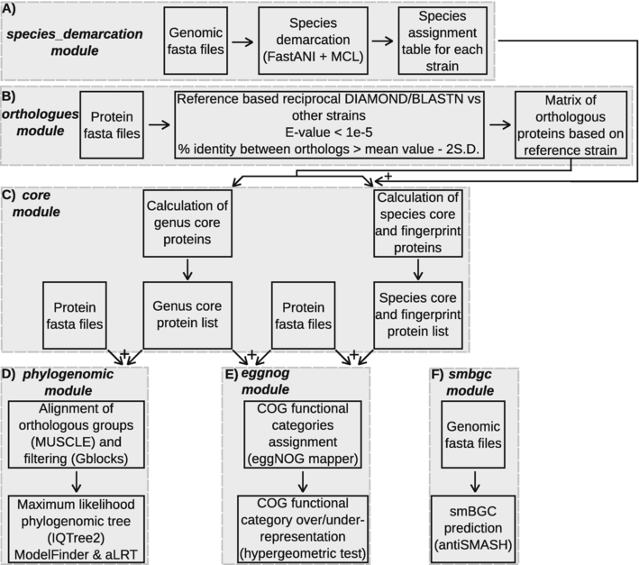

# pyPGCF

## Introduction

pyPGCF, is a python software package
that runs in the linux environment, in order to analyse bacterial genomes and perform:
i) phylogenomic analysis, ii) species demarcation, iii) identification of the core
proteins of a bacterial genus and its individual species, iv) identification of species-
specific fingerprint proteins that are found in all strains of a species and, at the same
time, are absent from all other species of the genus, v) functional annotation of the
core and fingerprint proteins with [eggNOG mapper](https://github.com/eggnogdb/eggnog-mapper), 
vi) identification of secondary metabolite
biosynthetic gene clusters (smBGCs) with [antiSMASH](https://github.com/antismash/antismash). 
This software has already
been implemented to analyse important bacterial genera (e.g. *Pseudomonas*, *Bacillus*, *Streptomyces*). 

## Workflow
The tool consists of 6 modules with each one devoted to one specific analysis as shown in the figure below.  

## Installation 
Currently installation is only available through the conda or mamba environment managers.  
If you don't have mamba installed just replace the word 'mamba' with 'conda'.  

First create a virtual environment with python 3.9:  
`mamba create -n pyPGCF python=3.9`  

Then install the software with the following command:  
`mamba install -c mnikolaidis -c conda-forge -c bioconda pypgcf`

Notes: 
1) The software should move to the bioconda channel in the near future

## Running
Details on how to run each module are available in video format in **[figshare](https://figshare.com/articles/media/pyPGCF_screencasts/22559992)**.
The help page of the software and each module is available through the --help flag: `pyPGCF --help`

## Citation
Nikolaidis, M., Oliver, S.G., Amoutzias, G.D., 2024. pyPGCF: a python software for phylogenomic analysis, species demarcation, identification of core and fingerprint proteins of bacterial genomes that are important for plants. Methods in Molecular Biology.
